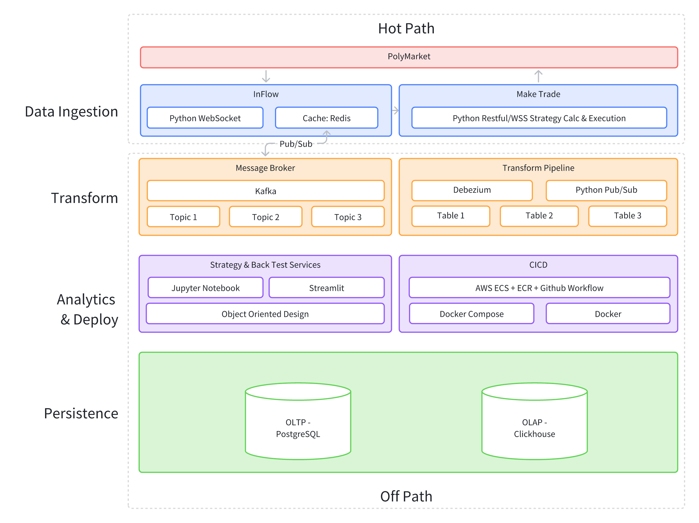

# Poly Punt: Prediction Market Data Infrastructure

**Poly Punt** is a high-performance data infrastructure designed to capture, store, and replay market data from prediction markets (specifically [Polymarket](https://polymarket.com/)) and underlying assets (e.g., BTC via Chainlink).

Driven by the potential for arbitrage and trading opportunities in prediction markets, this project provides an on-demand recall of order book snapshots and underlying asset history. It features a fully implemented pipeline for Bitcoin (BTC) prices and the "15-minute Up/Down" binary option markets.

## 🚀 Project Overview

The core objective of Poly Punt is to build a robust foundation for algorithmic trading strategies. While currently optimized for BTC markets, the design is scalable to other markets available on Polymarket.

**Key Features:**
* **Real-time Ingestion:** Captures data via Polymarket websockets.
* **Replay Capability:** accurate historical replay of order books for backtesting.

## 🏗 System Architecture

The system adopts a modular, micro-service architecture to ensure horizontal scaling and decoupling. The architecture is split into two distinct pipelines to address different optimization goals:

### 1. Hot-Path (Trading Engine)
* **Goal:** Minimize Latency.
* **Function:** Handles real-time signal processing and order execution. This path bypasses heavy persistence layers to react instantly to market moves.

### 2. Off-Path (Data Pipeline)
* **Goal:** Maximize Durability, Integrity, and Availability.
* **Function:** Responsible for logging, historical storage, and system recovery.
* **Components:** Ensures no data is lost during ingestion, using robust message queues and durable storage.

## 🛠 Tech Stack

We utilize a modern stack to handle high-throughput data with reliability:

* **Languages:** Python, SQL, Shell Script
* **Caching & Queues:** Redis, Kafka
* **CDC (Change Data Capture):** Debezium
* **Databases:** PostgreSQL (Operational), ClickHouse (Analytics)
* **Infrastructure:** AWS ECS + ECR, Docker
* **CI/CD:** GitHub Actions

## 📺 Demo

Explore a live replay of the order book and price feeds:
👉 **[Launch Demo](https://orderbook.polypunt.click)**

**Demo Capabilities:**
* Visualize past BTC prices and 15-min binary option markets.
* Playback full Order Book snapshots.
* Analyze cumulative depth at tick level, 1-second, and 5-second intervals.

## 📊 Performance & Usage Summary

The system is currently self-hosted.

| Metric | Value |
| :--- | :--- |
| **Data Ingestion** | ~5 GB writes to Postgres / day |
| **Memory Allocation** | 12 GB allocated (Avg usage: 6 GB) |
| **Hardware** | M4 Mac Mini (10-core CPU, 16GB RAM, 256GB SSD) |
| **Storage** | External SSDs |

## 📦 Getting Started

TODO 